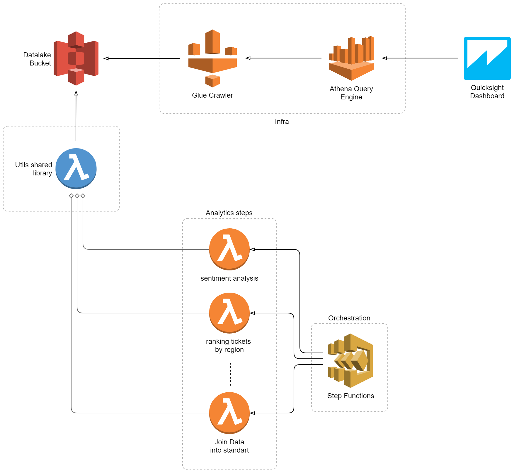

# aws lightweight complaint analysis

This project contains
  - An exploratory analysis built in Jupyter Notebook with pandas
  - A cloud architecture implementation to support the ETL operations defined

### Used tools & libs
  - [serverless framework](https://www.serverless.com/)
  - [pandas library](https://pandas.pydata.org/)
  - [jupyterlab](https://jupyter.org/)
  - [aws cli](https://aws.amazon.com/cli/)

### Architecture

### Troubleshooting

Change the buckets / paths to yours case you wanna test in your own aws environment
